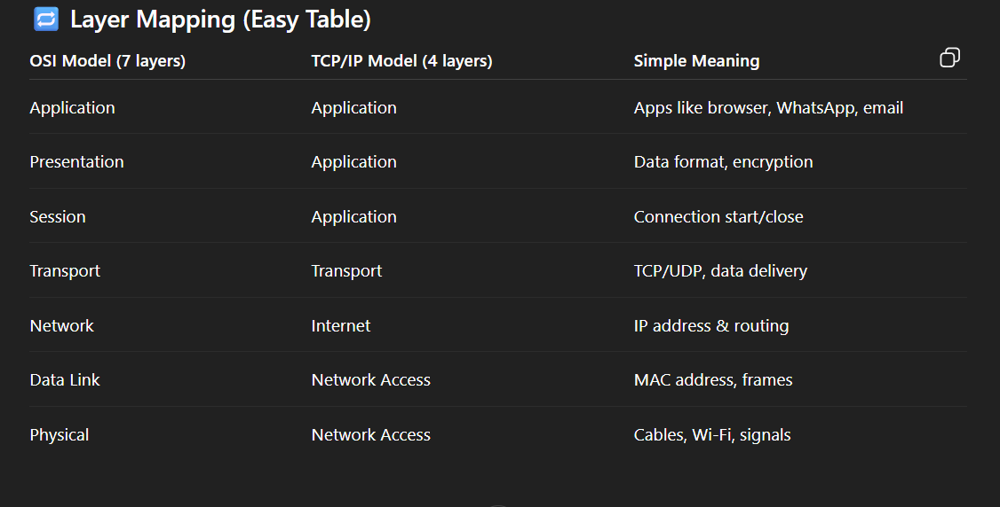
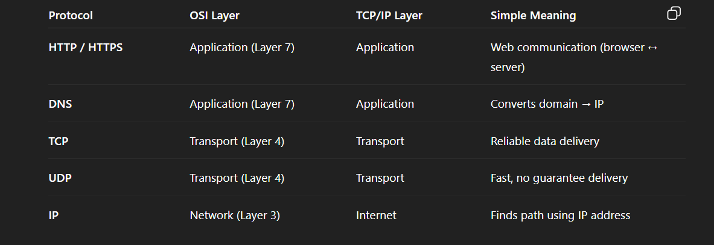

# Day 14 – Networking Fundamentals & Hands-on Checks

### OSI vs TCP/IP Model (Simple Words)

1. OSI Model (7 layers) – Learning model

OSI is mainly for understanding and teaching.
It breaks networking into 7 clear steps, so you know what happens where.

2. TCP/IP Model (4 layers) – Real-life model

TCP/IP is what the actual internet uses.
It combines some OSI layers to keep things simple and practical.

### Where IP, TCP/UDP, HTTP/HTTPS, DNS sit in the stack

### Identity: hostname -I (or ip addr show) — note your IP.

hostname -I => This command shows your system’s IP address(es).fast
ip addr show => This is a detailed command.

### Reachability: ping <target>

What ping does 
* ping checks whether a system is reachable or not
* It sends small packets and waits for a reply
* From the reply, we understand:
     Latency (time delay)
     Packet loss (data loss)

CMD [ping google.com]

### Path: traceroute <target> (or tracepath) — note any long hops/timeouts.

traceroute => provides detailed hop-level diagnostics and usually needs root privileges, while
tracepath => is a simpler, non-root tool that also discovers path MTU.

CMD [traceroute <target> / tracepath <target>]

### Ports: ss -tulpn (or netstat -tulpn) — list one listening service and its port.

ss -tulpn => Shows which services are running, Tells which port they are listening on, Also shows which process (PID/program) is using the port

*How to read this*

-t TCP

-u UDP

-l Listening

-p Process name

-n Port numbers

### Name Resolution: dig <domain> or nslookup <domain>

*What this does*
* Converts a domain name (like google.com)
* Into an IP address
* This process is called DNS resolution

CMD[dig google.com, nslookup google.com]

dig → more detailed (preferred in Linux)
nslookup → simpler output

### HTTP Check: curl -I <url>

*What it does*
* Sends a request to a website
* Only fetches headers (not full page)
* Shows HTTP status code

-I = HEAD request (headers only)

curl -I https://google.com

Status in output:- HTTP/2 200

*If website redirects (like http → https), use:*

curl -I -L http://google.com
-L follows redirects.

### Connections Snapshot

CMD [netstat -an | head]

*What it does*
* -a → shows all sockets
* -n → shows numeric addresses (no DNS resolve)
* | head → only first few lines

eg:

tcp   0  0 0.0.0.0:22      0.0.0.0:*      LISTEN
tcp   0  0 0.0.0.0:80      0.0.0.0:*      LISTEN
tcp   0  0 172.31.24.125:22 103.120.255.6:53422 ESTABLISHED
tcp   0  0 172.31.24.125:80 142.250.183.14:443  ESTABLISHED

